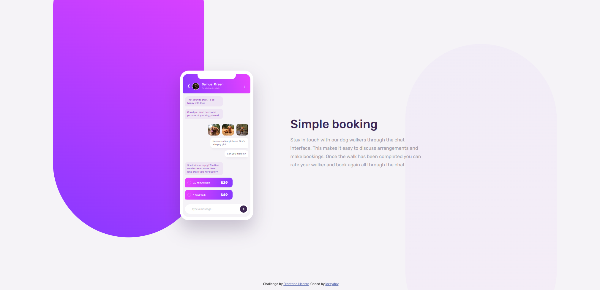

# Frontend Mentor - Chat app CSS illustration solution

This is a solution to the [Chat app CSS illustration challenge on Frontend Mentor](https://www.frontendmentor.io/challenges/chat-app-css-illustration-O5auMkFqY). Frontend Mentor challenges help you improve your coding skills by building realistic projects.

## Table of contents

- [Overview](#overview)
  - [The challenge](#the-challenge)
  - [Screenshot](#screenshot)
  - [Links](#links)
- [My process](#my-process)
  - [Built with](#built-with)
  - [What I learned](#what-i-learned)
  - [Continued development](#continued-development)
  - [Useful resources](#useful-resources)
- [Author](#author)

## Overview

### The challenge

Users should be able to:

- View the optimal layout for the component depending on their device's screen size

### Screenshot



### Links

- Solution URL: [Frontend Mentor Solution](https://www.frontendmentor.io/solutions/chat-app-illustration-using-html-and-css-iizMh7ysaw)
- Live Site URL: [Chat App Illustration](https://jezzydev.github.io/chat-app-illustration)

## My process

### Built with

- Semantic HTML5 markup
- CSS custom properties
- Flexbox
- CSS Grid
- Pseudo-elements

### What I learned

I can use unicode, hex code, html code, html entity to add symbols, shapes, arrows, etc.

```html
<div class="hamburger-btn">&#8942;</div>
```

I can use ::before and ::after pseudo elements to create background designs.

```css
.chat-container-outer::before {
  content: "";
  border-radius: 255px;
  position: absolute;
  top: -50%;
  left: -70%;
  transform: translate(-50%, -20%);
  width: 510px;
  height: 1018px;
  background: linear-gradient(
    27deg,
    var(--color-light-violet) 0%,
    var(--color-light-magenta) 100%
  );
  z-index: -1;
}

.text-container::after {
  content: "";
  border-radius: 255px;
  position: absolute;
  top: -50%;
  right: -50%;
  transform: translate(45%, -15%);
  width: 510px;
  height: 1018px;
  background: linear-gradient(
    153deg,
    var(--color-light-violet),
    var(--color-light-magenta)
  );
  z-index: -1;
  opacity: 3%;
}
```

### Continued development

I need to learn how to plan and organize CSS styles for reusability and responsive web design.

### Useful resources

- [Toptal HTML Arrows](https://www.toptal.com/designers/htmlarrows/symbols/) - This helped me find the right code for an ellipsis symbol.
- [MDN](https://developer.mozilla.org/en-US/docs/Web) - This helped me with syntax and usage of CSS properties.

## Author

- Website - [jezzydev](https://github.com/jezzydev)
- Frontend Mentor - [@jezzydev](https://www.frontendmentor.io/profile/jezzydev)
